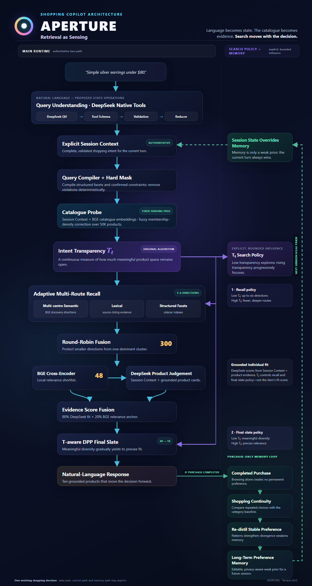

# APERTURE

### Retrieval as Sensing for Conversational Shopping

APERTURE is a catalogue-grounded shopping copilot that treats a conversation as one
evolving decision. It turns natural shopper language into an explicit Session Context,
probes the live catalogue to compute **Intent Transparency**, and uses that signal to
control multi-route retrieval and final-set composition.

> **Shopping intent is a journey, not a label.**

<p align="center">
  
</p>

## Results at a glance

| Evaluation | Result |
|---|---:|
| Official 200-session Technical Score | **0.9624** |
| Official 200-session Hit@10 | **1.0000** |
| 2,000-session public-like stress test | **1,997 / 2,000 targets recalled** |
| Natural-language benchmark Recall@10 | **1.000** |
| Exploration Satisfaction | **87.4%** |
| Intent Transparency ablation lift | **+36.5 pp Recall@10** |

The 2,000-session suite is an internal public-like stress test, not organizer ground
truth or an independent holdout. The complementary 200-journey dataset, benchmark
contract, deterministic scorer, and frozen aggregate results are checked in under
`benchmarks/catalogue_grounded_200/`.

## Included benchmarks

The repository ships both evaluation layers used in the submission:

| Benchmark | Checked-in data | Evaluator |
|---|---|---|
| Official released 200 | `data/public_set.jsonl` | `evaluator/local_evaluator.py` |
| Catalogue-Grounded 200 | `benchmarks/catalogue_grounded_200/journeys.jsonl` | `evaluator/catalogue_grounded_evaluator.py` |

The second suite contains 200 fixed multi-turn journeys with **6–8 grounded preference
dimensions per listing**, including refinements, exclusions, boundary replies, and
intent overrides. Ground-truth ASINs remain evaluator-only and are never passed to the
Agent. Its manifest pins every source file by SHA-256; `reported-results.json` contains
the three reported comparison rows and the controlled Intent Transparency ablation.

Run the checked-in suite against any organizer-compatible Agent factory:

```bash
python -m evaluator.catalogue_grounded_evaluator \
  --catalog data/catalog.jsonl \
  --agent-factory starter.agent:Agent \
  --output catalogue-grounded-results.json
```

Rebuild the semantic journey layer from the checked-in source-grounded cards with zero
API calls:

```bash
python scripts/benchmark/build_product_card_disclosure_review.py \
  --all-samples \
  --minimum-facts 6 \
  --maximum-facts 8 \
  --output artifacts/benchmark/catalogue-grounded-200
```

The committed JSONL is the fixed semantic benchmark. The full-pipeline runner can apply
the checked-in DeepSeek surface realizer for varied natural wording while deterministic
code continues to own disclosure, withdrawal, override, and scoring state.

## Reproduce the official benchmark

The submitted APERTURE Agent runs locally with Python 3.10+ and the organizer's 50K
catalogue. Official public and hidden-set evaluation requires no API key, network
request, model download, or GPU.

### 1. Install

Clone the repository and create an isolated environment:

```bash
git clone https://github.com/Terrace-NUS/tiktok-techjam-shopping-copilot.git
cd tiktok-techjam-shopping-copilot
python -m venv .venv
source .venv/bin/activate  # macOS/Linux
# Windows PowerShell: .\.venv\Scripts\Activate.ps1
```

Install the locked runtime and evaluation dependencies:

```bash
python -m pip install --upgrade pip
python -m pip install --require-hashes -r requirements/runtime.lock
python -m pip install -e ".[dev]"
```

### 2. Add the competition catalogue

Place the immutable organizer catalogue here:

```text
data/catalog.jsonl
```

The expected file contains 50,000 product rows. APERTURE never rewrites it.

### 3. Run all 200 released sessions

The released 200-session development set is checked in at `data/public_set.jsonl`.
Run the complete organizer-compatible evaluation with:

```bash
python -m evaluator.local_evaluator \
  --catalog data/catalog.jsonl \
  --dataset data/public_set.jsonl \
  --output results.json
```

The output contains Hit@10, MRR, MTTC, the recommended Technical Score, scenario-level
metrics, and per-session evidence. This run reports zero model-token usage.

### 4. Instantiate APERTURE for hidden-set evaluation

`starter/agent.py` exports the exact class loaded by the official evaluator. Instantiate
it once with the organizer catalogue, reset it once for each hidden session, and call
`respond(...)` for every shopper turn:

```python
from starter.agent import Agent

agent = Agent(catalog_path=organizer_catalog_path)

agent.reset(session_id, user_profile)

response = agent.respond(
    session_id=session_id,
    user_message=user_message,
    turn=turn_number,
    top_k=10,
)
```

State is isolated by `session_id`, so one process may evaluate multiple hidden sessions.
The returned object follows the organizer contract:

```text
message
ask_attribute
recommendations[].parent_asin
recommendations[].score
usage.prompt_tokens
usage.completion_tokens
```

The evaluator's existing `from starter.agent import Agent` import therefore loads
APERTURE directly; the organizer's original BM25 implementation is only the comparison
baseline and is not run by this repository. Conformance is checked against the
[published Agent interface](https://github.com/TechJam2026/techjam-conversational-search#agent-interface),
[machine-readable response contract](https://github.com/TechJam2026/techjam-conversational-search/blob/main/docs/agent_api_contract.json),
and [official evaluator](https://github.com/TechJam2026/techjam-conversational-search/blob/main/evaluator/local_evaluator.py).

## Full APERTURE

The complete model-backed pipeline enables:

- DeepSeek native-tool Query Understanding;
- explicit, validated Session Context transitions;
- the 50K-product Catalogue Probe and Intent Transparency;
- adaptive semantic, lexical, and structured-facet recall;
- local BGE embeddings and cross-encoder reranking;
- evidence-grounded DeepSeek product judgement;
- transparency-aware final-set selection; and
- a replayable audit record for every turn.

### 1. Install the retrieval stack

```bash
python -m pip install --require-hashes -r requirements/retrieval.lock
python -m pip install -e ".[dev,retrieval]"
```

Full APERTURE requires a CUDA-capable GPU, a DeepSeek API key, local BGE model weights,
and the generated semantic release, dense index, and intent-volume density cache.

### 2. Configure and run the Agent

Pass every full-pipeline dependency explicitly:

```python
import os
from pathlib import Path

from shopping_copilot.application import FullApertureConfig
from starter.agent import Agent

config = FullApertureConfig(
    api_key=os.environ["DEEPSEEK_API_KEY"],
    semantic_release=Path("artifacts/catalog-semantic/release-v0"),
    dense_index=Path("artifacts/retrieval/dense-v0"),
    density_cache=Path("artifacts/retrieval/intent-volume-density-v0.npz"),
    product_card_sidecar=Path(
        "data/product_fact_cards/deepseek_7011_v1/product-facts.jsonl.gz"
    ),
    device="cuda",
)

agent = Agent(
    catalog_path="data/catalog.jsonl",
    mode="full",
    full_config=config,
)
agent.reset("demo-session", {})
response = agent.respond(
    "demo-session",
    "I need something understated for commuting with a 15-inch laptop.",
    turn=1,
    top_k=10,
)
```

The constructor validates every asset before accepting a turn. Product facts,
embeddings, semantic facets, indexes, and density caches remain sidecars; the organizer
catalogue stays immutable.

### 3. Run the complete multi-turn protocol

After preparing the same sidecar assets, run:

```bash
python scripts/simulator/evaluate_full_pipeline_other.py \
  --catalog data/catalog.jsonl \
  --semantic-release artifacts/catalog-semantic/release-v0 \
  --dense-index artifacts/retrieval/dense-v0 \
  --density-cache artifacts/retrieval/intent-volume-density-v0.npz \
  --product-card-sidecar data/product_fact_cards/deepseek_7011_v1/product-facts.jsonl.gz \
  --api-key-file path/to/deepseek-key.txt \
  --device cuda \
  --output-dir artifacts/evaluations/full-pipeline
```

The target ASIN remains on the evaluator side of the boundary. Every turn and completed
session is appended to JSONL, and interrupted runs can be continued with `--resume`.
Use `--limit` for a smoke run before starting the full evaluation.

## Query Understanding evaluation

Validate the checked-in prompt suites without making API calls:

```bash
python scripts/query_understanding/evaluate_prompts.py \
  --cohort all \
  --tier full \
  --validate-only
```

Replay the same suites against DeepSeek:

```bash
python scripts/query_understanding/evaluate_prompts.py \
  --cohort all \
  --tier full \
  --api-key-env DEEPSEEK_API_KEY \
  --output artifacts/evaluations/query-understanding.json
```

## Test and verify

Run the complete verification suite:

```bash
python -m pytest
python -m ruff check src tests/unit
python -m ruff format --check src tests/unit
python -m mypy
```

The release commit passes **1,145 tests**, Ruff linting and formatting, and strict mypy
checking across 172 source files.

## Repository layout

| Path | Purpose |
|---|---|
| `src/shopping_copilot/` | Session state, Query Understanding, catalogue semantics, Probe, retrieval, ranking, response, and benchmark logic |
| `starter/agent.py` | APERTURE entry point matching the organizer Agent API |
| `evaluator/` | Frozen local compatibility evaluator |
| `benchmarks/catalogue_grounded_200/` | Released 200-journey dataset, pinned manifest, and reported results |
| `scripts/` | Reproducible builders, evaluations, and benchmark runners |
| `config/` | Frozen runtime policies and prompt/evaluation fixtures |
| `data/public_set.jsonl` | 200 released development sessions |
| `data/product_fact_cards/` | Source-grounded product-fact sidecar assets |
| `requirements/` | Locked runtime and retrieval dependencies |
| `assets/` | Public project visuals |

## Models and technologies

- **DeepSeek API (`deepseek-v4-flash`)** for native-tool Query Understanding and
  evidence-grounded product judgement
- **BAAI/bge-small-en-v1.5** for dense catalogue embeddings
- **BAAI/bge-reranker-v2-m3** for cross-encoder relevance
- **PyTorch + CUDA** for full-catalogue vector computation
- **NumPy** for fusion, density correction, and DPP selection
- **Sentence Transformers** for local embedding and reranking models

## Data, privacy, and provenance

- Competition catalogue rows are never rewritten.
- Product facts retain source references and quoted supporting evidence.
- Provider response IDs, API credentials, and private model metadata are excluded from
  released sidecars.
- Browsing alone does not mutate the supplied cross-session profile.
- Current Session Context always takes precedence over profile preferences.

The catalogue is derived from
[Amazon Reviews 2023](https://amazon-reviews-2023.github.io/) by McAuley Lab, UCSD.
See [DATA_ATTRIBUTION.md](DATA_ATTRIBUTION.md) and
[THIRD_PARTY_NOTICES.md](THIRD_PARTY_NOTICES.md) for redistribution and dependency
attribution.
